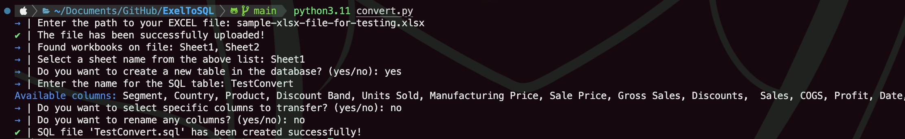

# Instructions for Using the Excel to SQL Generator Program

## How the Program Works

This program allows users to upload Excel files, select sheets and columns, and then generate SQL scripts for creating tables and inserting data into a database. Users can choose which columns to transfer, rename them, and specify the name of the table to be created. The program creates a `.sql` file that can be used for database operations.

## Installation

1. **Ensure that you have Python installed** (version 3.9 or higher). You can download it from the [official Python website](https://www.python.org/downloads/).
2. **Clone the repository** with the program code to your computer:
    ```bash
    git clone https://github.com/Dimiqhz/Excel2SQL.git
    ```
3. **Navigate to the program directory**:
    ```bash
    cd Excel2SQL
    ```
4. **Install the required libraries**:
    ```bash
    pip install openpyxl colorama pandas xlrd
    ```

## Running the Program

1. Open a terminal or command prompt.
2. Navigate to the directory where your Python script is located.
3. Run the program with the following command:
    ```bash
    python convert.py
    ```

## Using the Program

1. **Loading the Excel File**:
    - The program will prompt you to enter the path to the Excel file (`.xls` or `.xlsx`). Ensure that the file exists at the specified path.

2. **Selecting a Sheet**:
    - After loading the file, the program will display a list of available sheets. Select one by entering its name.

3. **Table Creation**:
    - You will be asked if you want to create a new table in the database. 
      - If `yes`, specify the name of the new table to be created.
      - If `no`, you will need to specify the name of the existing table where the data will be inserted.

4. **Selecting Columns**:
    - The program will ask if you want to select specific columns for transfer. Answer `yes` or `no`.
    - If `yes`, enter the names of the columns separated by commas. Only the selected columns will be considered for renaming and data insertion.

5. **Renaming Columns**:
    - The program will ask if you want to rename the selected columns. If yes, you can only rename those columns that you have selected. Enter new names for each column or leave it blank to keep the old names.

6. **Generating SQL**:
    - After all prompts are completed, the program will create a `.sql` file in the current directory.



## Notes

- Ensure that the Excel file contains headers in the first row, as these will be used as column names.
- The program does not support complex data types like dates or numeric formats. All values will be recorded as text.
- Errors during file loading or SQL creation will be displayed on the screen.

## Conclusion

This program simplifies the process of transferring data from Excel to SQL. Customize your SQL commands as needed, and ensure your data is ready for database insertion. For further assistance or issues, feel free to contact the project maintainers.